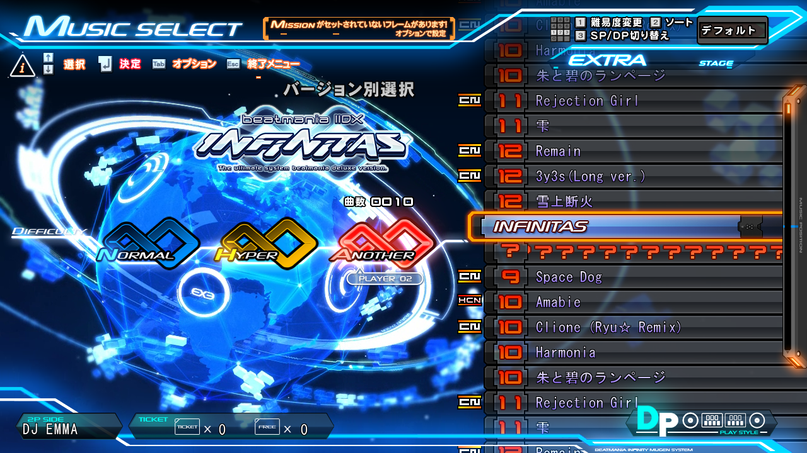

# infinitas_acpfix

Fixes some font issues with beatmania IIDX INFINITAS on foreign system locales.

Can be loaded automatically with [infinitas_chainload](https://github.com/emskye96/infinitas_chainload).

| Before                        | After                       |
| ----------------------------- | --------------------------- |
|  |  |

## Usage

1. Compile and copy `infinitas_acpfix.dll` to the `game/app` directory.
2. Add `infinitas_acpfix.dll` as a new line in the `chainload.txt` file.